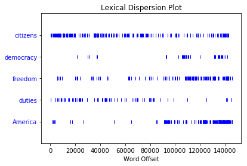

Natural Language Processing with NLTK
====================

Introduction to Natural Language Processing
-----------------------------------------

Natural language processing (NLP) is a field of computer science, artificial intelligence and computational linguistics concerned with the interactions between computers and human (natural) languages, and, in particular, concerned with programming computers to fruitfully process large natural language corpora. 

Challenges in natural language processing frequently involve natural language understanding, natural language generation (frequently from formal, machine-readable logical forms), connecting language and machine perception, dialog systems, or some combination thereof.

What is NLTK?
------------

NLTK is a leading platform for building Python programs to work with human language data. It provides easy-to-use interfaces to over 50 corpora and lexical resources such as WordNet, along with a suite of text processing libraries for classification, tokenization, stemming, tagging, parsing, and semantic reasoning, wrappers for industrial-strength NLP libraries, and an active discussion forum.

NLTK is a free, open source, community-driven project.

How to install NLTK?
-------------------

NLTK can be installed by the python package installer with tbe below command
```
pip install nltk
```


```python
#Importing NLTK package to our Python Script
import nltk

#Importing text corpus from NLTK
from nltk.book import *
```

    *** Introductory Examples for the NLTK Book ***
    Loading text1, ..., text9 and sent1, ..., sent9
    Type the name of the text or sentence to view it.
    Type: 'texts()' or 'sents()' to list the materials.
    text1: Moby Dick by Herman Melville 1851
    text2: Sense and Sensibility by Jane Austen 1811
    text3: The Book of Genesis
    text4: Inaugural Address Corpus
    text5: Chat Corpus
    text6: Monty Python and the Holy Grail
    text7: Wall Street Journal
    text8: Personals Corpus
    text9: The Man Who Was Thursday by G . K . Chesterton 1908


```python
#Initialization of our sample corpus
raw = """DENNIS Listen strange women lying in ponds distributing swords ,
 is no basis for a system of government. Supreme executive power derives from 
 a mandate from the masses, not from some farcical aquatic ceremony."""
```

Core Functionalities.
-------------------
1. Searching Text
2. Frequency Distribution
3. Tokenization
4. Stop Words
5. Stemming
6. Lemmatization
7. BiGrams and UniGrams

Searching Text
-------------

### Concordance

Concordance(token) gives you the context surrounding the argument token. It will show you the sentences where token appears. Basically, if you want to use the .concordance(), you have to instantiate a Text object first, and then call it on that object.


```python
text1.concordance("monstrous")
```

    Displaying 11 of 11 matches:
    ong the former , one was of a most monstrous size . ... This came towards us , 
    ON OF THE PSALMS . " Touching that monstrous bulk of the whale or ork we have r
    ll over with a heathenish array of monstrous clubs and spears . Some were thick
    d as you gazed , and wondered what monstrous cannibal and savage could ever hav
    that has survived the flood ; most monstrous and most mountainous ! That Himmal
    they might scout at Moby Dick as a monstrous fable , or still worse and more de
    th of Radney .'" CHAPTER 55 Of the Monstrous Pictures of Whales . I shall ere l
    ing Scenes . In connexion with the monstrous pictures of whales , I am strongly
    ere to enter upon those still more monstrous stories of them which are to be fo
    ght have been rummaged out of this monstrous cabinet there is no telling . But 
    of Whale - Bones ; for Whales of a monstrous size are oftentimes cast up dead u


```python
text1.similar("monstrous")
```

    true contemptible christian abundant few part mean careful puzzled
    mystifying passing curious loving wise doleful gamesome singular
    delightfully perilous fearless


Frequency Distribution
--------------------
Since we often need frequency distributions in language processing, NLTK provides built-in support for them.


```python
#Generate Frequency Distribution from corpus
fdist = FreqDist(text5)
```


```python
#Show the top 10 word occurences in the corpus
fdist.tabulate(10)
```

       . JOIN PART    ?  lol   to    i  the  you    , 
    1268 1021 1016  737  704  658  648  646  635  596 


Lexical Disperion plot
--------------------
We can determine the location of a word in the text: how many words from the beginning it appears. This positional information can be displayed using a dispersion plot. Each stripe represents an instance of a word, and each row represents the entire text.


```python
text4.dispersion_plot(["citizens","democracy","freedom","duties","America"])
```





*Lexical dispersion plot for words in U.S. Presidential Inaugural Addresses: This can be
used to investigate changes in language use over time.*

Tokenization 
-----------
Given a character sequence and a defined document unit, tokenization is the task of chopping it up into pieces, called tokens.

Given a corpus, NLTK has inbuilt function to tokenize the corpus into sentences or words.


```python
# word_tokenize function is been used from NLTK tool to tokenize the corpus.
tokens = nltk.word_tokenize(raw)

print(tokens)
```

    ['DENNIS', 'Listen', 'strange', 'women', 'lying', 'in', 'ponds', 'distributing', 'swords', ',', 'is', 'no', 'basis', 'for', 'a', 'system', 'of', 'government', '.', 'Supreme', 'executive', 'power', 'derives', 'from', 'a', 'mandate', 'from', 'the', 'masses', ',', 'not', 'from', 'some', 'farcical', 'aquatic', 'ceremony', '.']


Stop Words
----------
"stop words" usually refers to the most common words in a language.
In computing, stop words are words which are filtered out before or after processing of natural language data.

Stop words can cause problems when searching for phrases that include them, particularly in names such as "The Who", "The The", or "Take That".

NLTK comes with a pre-defined list of stop words which can be used at our discretion.


```python
stopWords = nltk.corpus.stopwords.words('english')

print(stopWords)
```

    ['i', 'me', 'my', 'myself', 'we', 'our', 'ours', 'ourselves', 'you', 'your', 'yours', 'yourself', 'yourselves', 'he', 'him', 'his', 'himself', 'she', 'her', 'hers', 'herself', 'it', 'its', 'itself', 'they', 'them', 'their', 'theirs', 'themselves', 'what', 'which', 'who', 'whom', 'this', 'that', 'these', 'those', 'am', 'is', 'are', 'was', 'were', 'be', 'been', 'being', 'have', 'has', 'had', 'having', 'do', 'does', 'did', 'doing', 'a', 'an', 'the', 'and', 'but', 'if', 'or', 'because', 'as', 'until', 'while', 'of', 'at', 'by', 'for', 'with', 'about', 'against', 'between', 'into', 'through', 'during', 'before', 'after', 'above', 'below', 'to', 'from', 'up', 'down', 'in', 'out', 'on', 'off', 'over', 'under', 'again', 'further', 'then', 'once', 'here', 'there', 'when', 'where', 'why', 'how', 'all', 'any', 'both', 'each', 'few', 'more', 'most', 'other', 'some', 'such', 'no', 'nor', 'not', 'only', 'own', 'same', 'so', 'than', 'too', 'very', 's', 't', 'can', 'will', 'just', 'don', 'should', 'now', 'd', 'll', 'm', 'o', 're', 've', 'y', 'ain', 'aren', 'couldn', 'didn', 'doesn', 'hadn', 'hasn', 'haven', 'isn', 'ma', 'mightn', 'mustn', 'needn', 'shan', 'shouldn', 'wasn', 'weren', 'won', 'wouldn']


### Removing Stop Words from our corpus


```python
#Filtering the tokens by checking if it is not in stopwords
filterTokens = [token for token in tokens if token not in stopWords]

print(tokens)

print(filterTokens)
```

    ['DENNIS', 'Listen', 'strange', 'women', 'lying', 'in', 'ponds', 'distributing', 'swords', ',', 'is', 'no', 'basis', 'for', 'a', 'system', 'of', 'government', '.', 'Supreme', 'executive', 'power', 'derives', 'from', 'a', 'mandate', 'from', 'the', 'masses', ',', 'not', 'from', 'some', 'farcical', 'aquatic', 'ceremony', '.']
    ['DENNIS', 'Listen', 'strange', 'women', 'lying', 'ponds', 'distributing', 'swords', ',', 'basis', 'system', 'government', '.', 'Supreme', 'executive', 'power', 'derives', 'mandate', 'masses', ',', 'farcical', 'aquatic', 'ceremony', '.']


Stemming
--------
Stemming is the process of reducing inflected (or sometimes derived) words to their word stem, base or root form—generally a written word form.

Most common stemmers in NLTK are Porter and Lancaster Stemmers.
The Porter and Lancaster stemmers follow their own rules for stripping affixes. Observe that the Porter
stemmer correctly handles the word **lying** (mapping it to lie), whereas the Lancaster
stemmer does not.

**Porter Stemmer**


```python
#initializate Porter Stemmer
porter = nltk.PorterStemmer()

print(filterTokens)
#Stem each token in the corpus
print([porter.stem(token) for token in filterTokens])
```

    ['DENNIS', 'Listen', 'strange', 'women', 'lying', 'ponds', 'distributing', 'swords', ',', 'basis', 'system', 'government', '.', 'Supreme', 'executive', 'power', 'derives', 'mandate', 'masses', ',', 'farcical', 'aquatic', 'ceremony', '.']
    ['denni', 'listen', 'strang', 'women', 'lie', 'pond', 'distribut', 'sword', ',', 'basi', 'system', 'govern', '.', 'suprem', 'execut', 'power', 'deriv', 'mandat', 'mass', ',', 'farcic', 'aquat', 'ceremoni', '.']


**Lancaster Stemmer**


```python
#Initialize Lancaster Stemmer
lancaster = nltk.LancasterStemmer()

print(filterTokens)

#Stem Each token in the corpus
print([lancaster.stem(token) for token in filterTokens])
```

    ['DENNIS', 'Listen', 'strange', 'women', 'lying', 'ponds', 'distributing', 'swords', ',', 'basis', 'system', 'government', '.', 'Supreme', 'executive', 'power', 'derives', 'mandate', 'masses', ',', 'farcical', 'aquatic', 'ceremony', '.']
    ['den', 'list', 'strange', 'wom', 'lying', 'pond', 'distribut', 'sword', ',', 'bas', 'system', 'govern', '.', 'suprem', 'execut', 'pow', 'der', 'mand', 'mass', ',', 'farc', 'aqu', 'ceremony', '.']


Lemmatization
------------
lemmatisation is the algorithmic process of determining the lemma of a word based on its intended meaning.


```python
#Initialize Word Net Lemmatizer
lemmatizer = nltk.WordNetLemmatizer()

print(tokens)

#Lemmatize each token in the corpus
print([lemmatizer.lemmatize(token) for token in tokens])
```

    ['DENNIS', 'Listen', 'strange', 'women', 'lying', 'in', 'ponds', 'distributing', 'swords', ',', 'is', 'no', 'basis', 'for', 'a', 'system', 'of', 'government', '.', 'Supreme', 'executive', 'power', 'derives', 'from', 'a', 'mandate', 'from', 'the', 'masses', ',', 'not', 'from', 'some', 'farcical', 'aquatic', 'ceremony', '.']
    ['DENNIS', 'Listen', 'strange', 'woman', 'lying', 'in', 'pond', 'distributing', 'sword', ',', 'is', 'no', 'basis', 'for', 'a', 'system', 'of', 'government', '.', 'Supreme', 'executive', 'power', 'derives', 'from', 'a', 'mandate', 'from', 'the', 'mass', ',', 'not', 'from', 'some', 'farcical', 'aquatic', 'ceremony', '.']


NGrams
------
n-gram is a contiguous sequence of n items from a given sequence of text or speech.

An n-gram of size 1 is referred to as a ***unigram***; size 2 is a ***bigram*** (or, less commonly, a "digram"); size 3 is a ***trigram***. Larger sizes are sometimes referred to by the value of n in modern language, e.g., ***four-gram***, ***five-gram***, and so on.


```python
#Import the ngrams package
from nltk.util import ngrams

#Get BiGrams and TriGrams from corpus
bigrams = ngrams(tokens,2)
trigrams = ngrams(tokens,3)

print(list(bigrams))

print(list(trigrams))
```

    [('DENNIS', 'Listen'), ('Listen', 'strange'), ('strange', 'women'), ('women', 'lying'), ('lying', 'in'), ('in', 'ponds'), ('ponds', 'distributing'), ('distributing', 'swords'), ('swords', ','), (',', 'is'), ('is', 'no'), ('no', 'basis'), ('basis', 'for'), ('for', 'a'), ('a', 'system'), ('system', 'of'), ('of', 'government'), ('government', '.'), ('.', 'Supreme'), ('Supreme', 'executive'), ('executive', 'power'), ('power', 'derives'), ('derives', 'from'), ('from', 'a'), ('a', 'mandate'), ('mandate', 'from'), ('from', 'the'), ('the', 'masses'), ('masses', ','), (',', 'not'), ('not', 'from'), ('from', 'some'), ('some', 'farcical'), ('farcical', 'aquatic'), ('aquatic', 'ceremony'), ('ceremony', '.')]
    [('DENNIS', 'Listen', 'strange'), ('Listen', 'strange', 'women'), ('strange', 'women', 'lying'), ('women', 'lying', 'in'), ('lying', 'in', 'ponds'), ('in', 'ponds', 'distributing'), ('ponds', 'distributing', 'swords'), ('distributing', 'swords', ','), ('swords', ',', 'is'), (',', 'is', 'no'), ('is', 'no', 'basis'), ('no', 'basis', 'for'), ('basis', 'for', 'a'), ('for', 'a', 'system'), ('a', 'system', 'of'), ('system', 'of', 'government'), ('of', 'government', '.'), ('government', '.', 'Supreme'), ('.', 'Supreme', 'executive'), ('Supreme', 'executive', 'power'), ('executive', 'power', 'derives'), ('power', 'derives', 'from'), ('derives', 'from', 'a'), ('from', 'a', 'mandate'), ('a', 'mandate', 'from'), ('mandate', 'from', 'the'), ('from', 'the', 'masses'), ('the', 'masses', ','), ('masses', ',', 'not'), (',', 'not', 'from'), ('not', 'from', 'some'), ('from', 'some', 'farcical'), ('some', 'farcical', 'aquatic'), ('farcical', 'aquatic', 'ceremony'), ('aquatic', 'ceremony', '.')]


Parts of Speech tagging
---------------------
Part-of-speech tagging is one of the most important text analysis tasks used to classify words into their part-of-speech and label them according the tagset which is a collection of tags used for the pos tagging.

Item     | Value
-------- | ---
CC	|coordinating conjunction
CD	|cardinal digit
DT	|determiner
EX	|existential there 
FW	|foreign word
IN	|preposition/subordinating conjunction
JJ	|adjective	
JJR	|adjective, comparative	'bigger'
JJS	|adjective, superlative	'biggest'
LS	|list marker	1)
MD	|modal	could, will
NN	|noun, singular 'desk'
NNS	|noun plural	'desks'
NNP	|proper noun, singular	'Harrison'
NNPS|	proper noun, plural	'Americans'
PDT	|predeterminer	'all the kids'
POS	|possessive ending	parent's
PRP	|personal pronoun	I, he, she
PRP |	possessive pronoun	my, his, hers
RB	|adverb	very, silently,
RBR	|adverb, comparative	better
RBS	|adverb, superlative	best
RP	|particle	give up
TO	|to	go 'to' the store.
UH	|interjection	errrrrrrrm
VB	|verb, base form	take
VBD	|verb, past tense	took
VBG	|verb, gerund/present participle	taking
VBN	|verb, past participle	taken
VBP	|verb, sing. present, non-3d	take
VBZ	|verb, 3rd person sing. present	takes
WDT	|wh-determiner	which
WP	|wh-pronoun	who, what
WP$	|possessive wh-pronoun	whose
WRB	|wh-abverb	where, when


```python
posTags = nltk.pos_tag(tokens)

print(posTags)
```

    [('DENNIS', 'NNP'), ('Listen', 'NNP'), ('strange', 'JJ'), ('women', 'NNS'), ('lying', 'VBG'), ('in', 'IN'), ('ponds', 'NNS'), ('distributing', 'VBG'), ('swords', 'NNS'), (',', ','), ('is', 'VBZ'), ('no', 'DT'), ('basis', 'NN'), ('for', 'IN'), ('a', 'DT'), ('system', 'NN'), ('of', 'IN'), ('government', 'NN'), ('.', '.'), ('Supreme', 'NNP'), ('executive', 'NN'), ('power', 'NN'), ('derives', 'VBZ'), ('from', 'IN'), ('a', 'DT'), ('mandate', 'NN'), ('from', 'IN'), ('the', 'DT'), ('masses', 'NNS'), (',', ','), ('not', 'RB'), ('from', 'IN'), ('some', 'DT'), ('farcical', 'JJ'), ('aquatic', 'JJ'), ('ceremony', 'NN'), ('.', '.')]


Text Classification using NLTK
================

Classification is the task of choosing the correct class label for a given input. In basic classification tasks, each input is considered in isolation from all other inputs, and the set of labels is defined in advance.


### Naive Bayes Classifiers
Naive Bayes classifiers are a family of simple probabilistic classifiers based on applying Bayes' theorem with strong (naive) independence assumptions between the features.

NLTK comes with sample corpus which can be used to classify text and see its performance. Also, it has an inbuilt classfier function which will help us to classify text.

### Classifying Names

NLTK comes with inbuilt corpus which can be used to test out the classifier in NLTK.
We will be using the character names from the movie ***The Matrix***. 

### Feature selection
We would be using the last letter of the name as the feature.


```python
#Defining features from name
def gender_features(word):
        return {'last_letter': word[-1]}

gender_features('Shrek')
```


    {'last_letter': 'k'}


```python
#Importing names corpus from NLTK's inbuilt corpus database
from nltk.corpus import names
import random

# Bifercating male and female names from corpus
names = ([(name, 'male') for name in names.words('male.txt')] + 
         [(name, 'female') for name in names.words('female.txt')])

#Shuffling the list
random.shuffle(names)

#Getting features for our corpus 
featuresets = [(gender_features(n), g) for (n,g) in names]

#Splitting into Training and Test Datasets
train_set, test_set = featuresets[500:], featuresets[:500]

#Training the model using Naive-Bayes Classifier 
classifier = nltk.NaiveBayesClassifier.train(train_set)
```


```python
classifier.classify(gender_features('Nikhil'))
```


    'male'


```python
classifier.classify(gender_features('Monica'))
```


    'female'


```python
#Checking the accuracy of the model
print(nltk.classify.accuracy(classifier, test_set))
```

    0.742


Description of the association with course content
-----------------------------------------------

***Data Preprocessing***: Data preprocessing can be achieved using NLTK when the data is in the text format. For example: Getting the real meaningful content from the document using tokenization, stemming, lemmatization and ignoring stop words.

***Classification***: Text classification can be performed using NLTK by collecting the frequency distribution of the words in the corpus and ignoring common words to train and test the model better.

***Pattern Mining***: Achieve patterns in text using N grams.

***Top Analysis***: Achieved by collecting the frequency of all the words in the corpus and detecting the topic based on the top n words.
